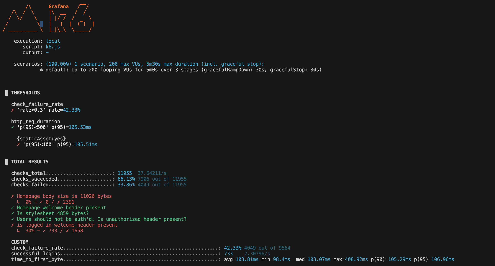
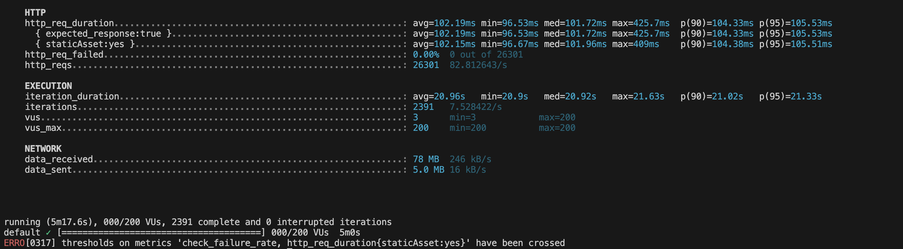

# k6 performance testing

This repository contains an script load tests example [K6](https://grafana.com/docs/k6/latest/) and thoroughly tested using [test](https://test.k6.io/).

## Description




## Technologies Used

* **[K6](https://grafana.com/docs/k6/latest/)**: open-source, developer-friendly, and extensible load testing tool.

## Prerequisites

Make sure you have the following installed on your system:

* **[k6](https://grafana.com/docs/k6/latest/set-up/install-k6/)** 

## Installation

1.  Clone this repository:
    ```bash
    git clone https://github.com/olivaalbert1/k6
    cd k6
    ```

2.  Install the dependencies using npm or yarn:
    ```bash
    brew install k6
    ```

## Running the tests

To start the development server for the API:

```bash
k6 run script.js
```
